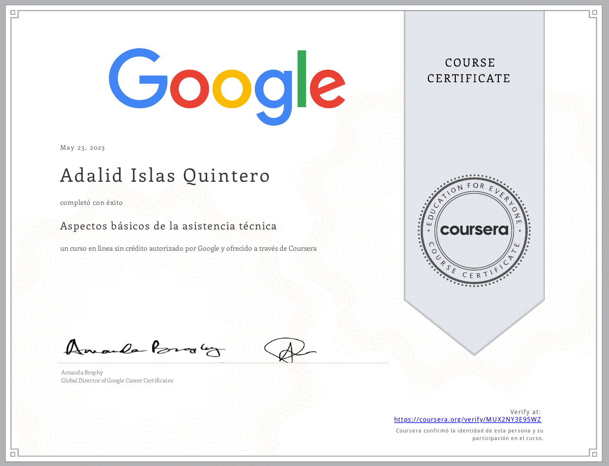
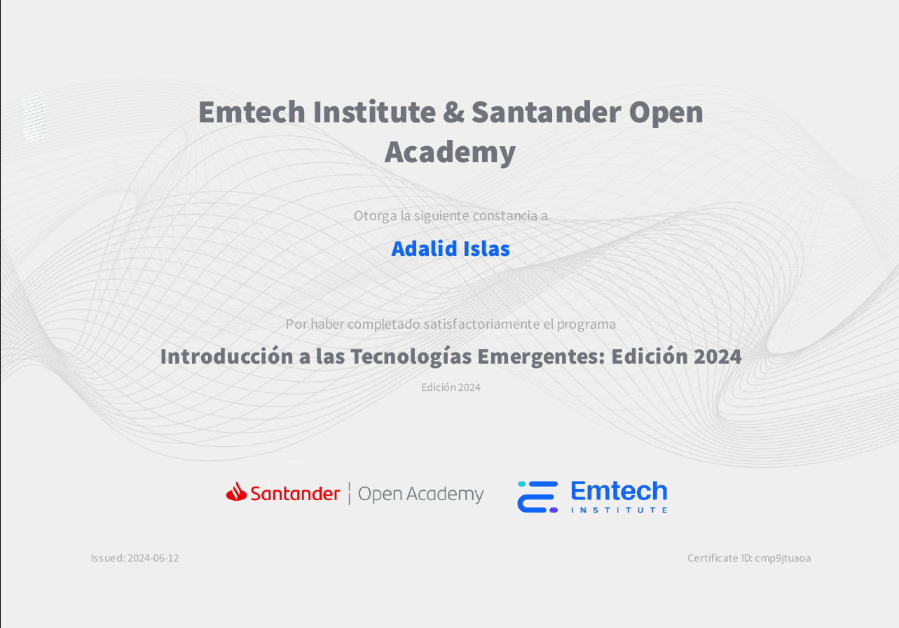

# 👋 Hola... 
Mi nombre es Adalid Islas Quintero, tengo 21 años y
actualmente me encuentro estudiando la Ingeniería en Desarrollo y Gestión de Software en la
Universidad Tecnológica de Xicotepec De Juárez.
- En este perfil podrás encontrar proyectos que me han ayudado durante mi formación académica, algunos de ellos son prácticas realizadas en clase y algunos otros son proyectos realizados de manera autodidacta para buscar aprender o mejorar en diferentes aspectos que tengan que ver con el área en la que me encuentro desarrollándome.

- El enfoque que pretendo dar va un poco más por el lado del FrontEnd, ya que es el área en la cual me siento más libre de desarrollar mis habilidades,
así como el uso de software libre hablando de sistemas operativos cono Linux.

Mis principales intereses son:
- Desarrollo Web FrontEnd con Frameworks/librerías como Angular, VueJS o React.
- Control y gestión de versiones para proyectos con Git, GitHub y GitLab.

## Tecnologías utilizadas a lo largo de mi formación:
  
   

## Herramientas utilizadas a lo largo de mi formación:
  
   

## Sistemas Operativos utilizados a lo largo de mi formación:
  
  

## Certificados obtenidos a lo largo de mi formación:

   <!-- - [@Aldair-NPM](https://www.github.com/Aldair-NPM)
   - [@EmilioMendozaCortes](https://www.github.com/EmilioMendozaCortes)
   - [@adalid2608](https://www.github.com/adalid2608) -->

   
  
  

        
        
        
        
    
     

Con el tiempo espero hacer de este espacio un lugar en el que se puedan demostrar
todas y cada una de las habilidades que poseo.
Me gusta aprender siempre cosas nuevas o reforzar conceptos que ya sé y así poder hacer proyectos de calidad.

Gracias por estar aquí, por tomarte el tiempo de leer esta pequeña introducción a lo que para mí sé ha convertido en un mundo lleno de posibilidades.
